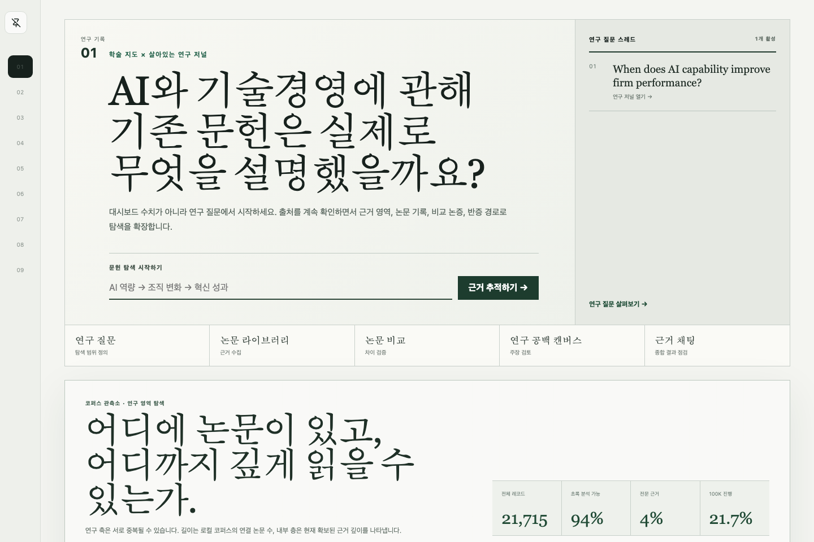
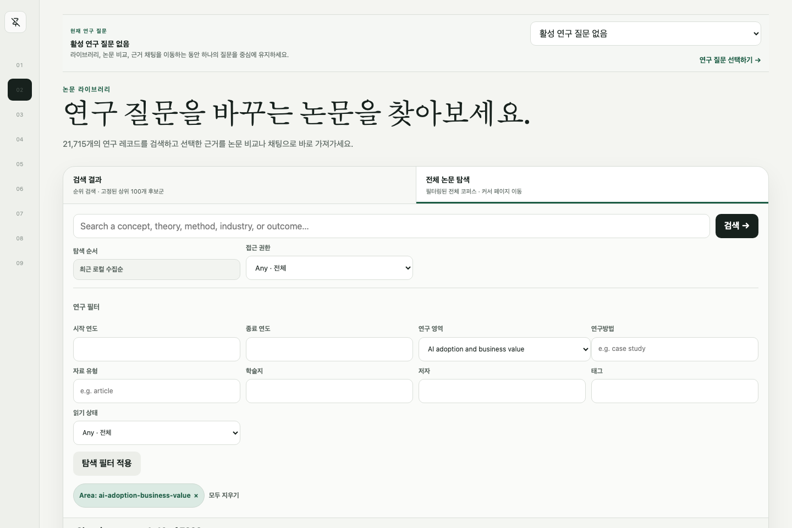
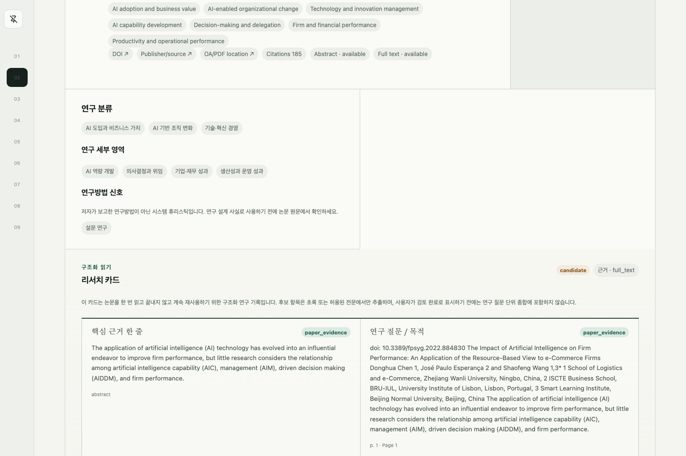
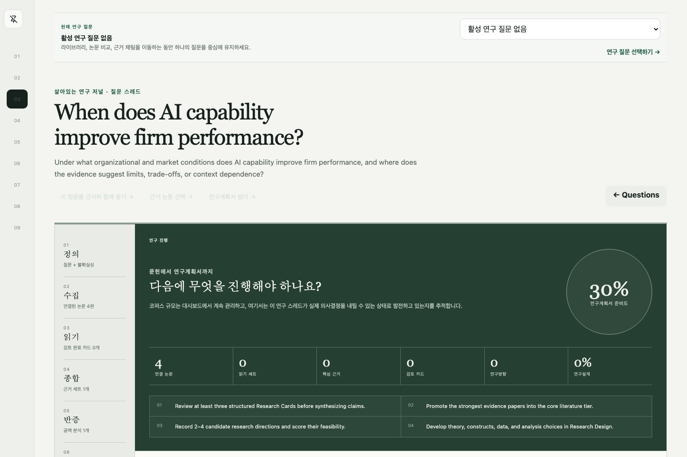
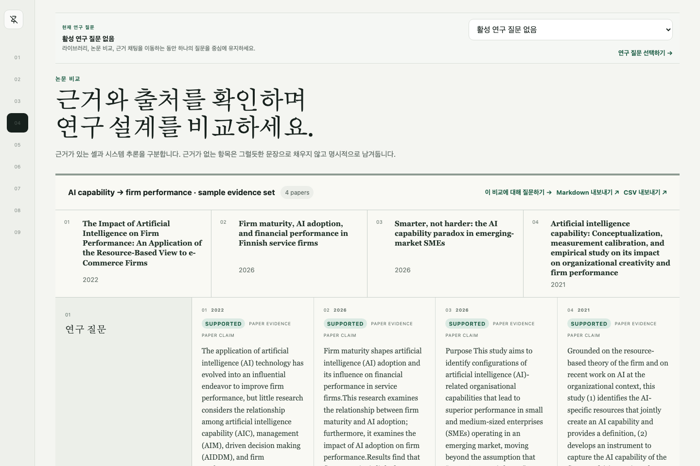
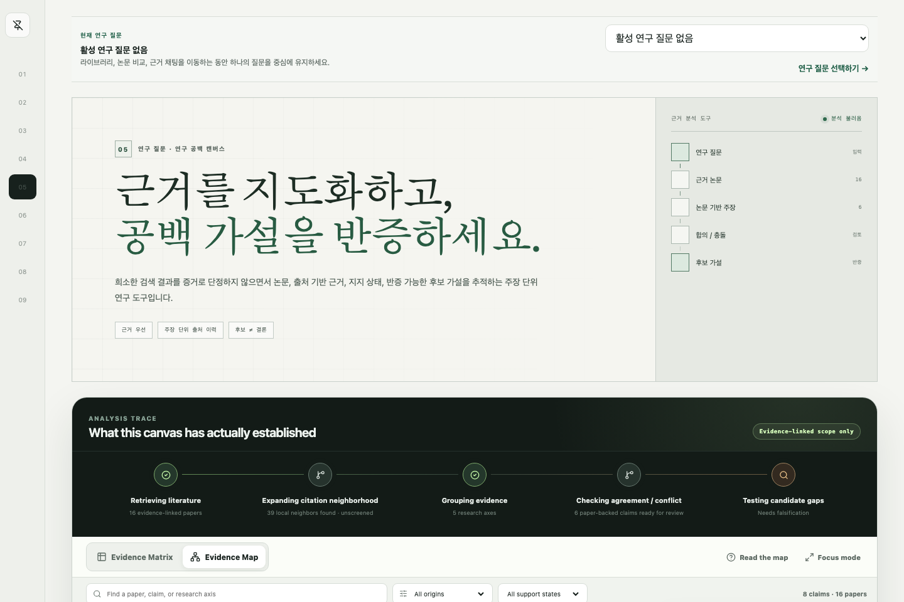
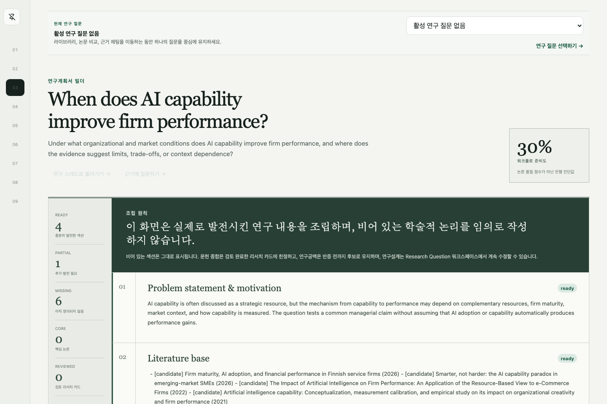
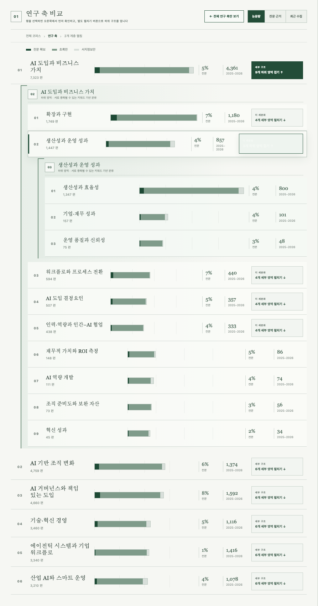

# AI × MOT Research Lab

**AI & Management of Technology Research Intelligence**<br>
**AI와 기술경영 연구를 위한 근거 기반 개인 연구 시스템**

[Public read-only demo](https://research.oosu.dev/) · [Architecture](docs/architecture.md) · [Data sources](docs/data-sources.md) · [Evaluation](docs/evaluation-results.md) · [Deployment](docs/deployment.md)

> Build the research domain as a durable, evidence-traceable workspace—not as a one-shot paper chatbot.

---

## 1. Product overview / 제품 개요

AI × MOT Research Lab is a personal research intelligence system for graduate-level work at the intersection of **Artificial Intelligence** and **Management of Technology (MOT)**. The project treats the literature corpus as a durable research asset, then connects discovery, reading, comparison, gap testing, research-question development, research design, and proposal preparation on top of the same evidence model.

The public deployment is intentionally **read-only**. It demonstrates the research model and evidence workflow without exposing personal workspace mutations.

AI × MOT Research Lab은 **인공지능(AI)** 과 **기술경영(MOT)** 의 교차 영역에서 대학원 수준의 연구를 진행하기 위한 개인 연구 인텔리전스 시스템입니다. 논문 코퍼스를 일회성 검색 결과가 아니라 지속적으로 축적되는 연구 자산으로 보고, 같은 근거 모델 위에서 탐색 → 읽기 → 비교 → 공백 반증 → 연구질문 발전 → 연구설계 → 연구계획서 작성 흐름을 연결합니다.

공개 배포 환경은 의도적으로 **읽기 전용**입니다. 개인 워크스페이스의 수정 기능을 노출하지 않으면서 연구 구조와 근거 추적 방식을 보여주는 포트폴리오 데모입니다.

---

## 2. Why this exists / 왜 만들었나

The project started from a practical graduate-school problem: finding papers is not the same as building a research direction. A useful system has to preserve what was read, how papers relate, where claims came from, what remains uncertain, and which questions are still worth testing.

The guiding product question is:

> **How is AI changing organizations, industries, innovation activity, and managerial decision-making; what has existing research explained, and what question is worth testing next?**

Instead of scattering search history, notes, comparison tables, PDFs, and research questions across different tools, the project keeps them attached to a canonical scholarly corpus with explicit provenance.

이 프로젝트는 대학원 연구에서 생기는 현실적인 문제에서 시작했습니다. 논문을 “찾는 것”과 연구 분야를 “만드는 것”은 다릅니다. 실제로 도움이 되는 시스템이라면 무엇을 읽었는지, 논문들이 어떻게 연결되는지, 어떤 주장이 어디에서 왔는지, 무엇이 아직 불확실한지, 다음에 어떤 질문을 검증해야 하는지를 지속적으로 남겨야 합니다.

프로젝트의 중심 질문은 다음과 같습니다.

> **AI는 조직·산업·혁신 활동·경영 의사결정을 어떻게 바꾸고 있으며, 기존 연구는 무엇을 설명했고, 다음에는 어떤 질문을 검증할 가치가 있는가?**

검색 기록, 메모, 비교표, PDF, 연구질문을 여러 도구에 흩어 놓는 대신, 이를 출처가 추적되는 하나의 canonical scholarly corpus에 연결하는 것이 목표입니다.

---

## 3. Research workflow / 연구 워크플로

The current product is organized around a research loop rather than a collection of disconnected AI features:

```text
Corpus Observatory
      ↓
Paper Library
      ↓
Reading + Research Cards
      ↓
Research Question Workspace
      ↓
Evidence Comparison
      ↓
Gap Falsification
      ↓
Research Direction + Design
      ↓
Proposal Builder
```

The corpus remains the dashboard and starting point, but each downstream screen should turn the corpus into a concrete research decision.

현재 제품은 서로 분리된 AI 기능 모음이 아니라 하나의 연구 루프로 구성합니다.

```text
코퍼스 관측소
      ↓
논문 라이브러리
      ↓
읽기 + 리서치 카드
      ↓
연구 질문 워크스페이스
      ↓
근거 비교
      ↓
연구 공백 반증
      ↓
연구방향 + 연구설계
      ↓
연구계획서 빌더
```

코퍼스 대시보드는 계속 첫 화면이자 출발점으로 유지하지만, 이후의 각 화면은 논문 숫자를 실제 연구 의사결정으로 바꾸는 역할을 합니다.

---

## 4. Product screens / 화면별 기능

### 4.1 Corpus Observatory / 코퍼스 관측소



The home dashboard compares the major AI × MOT research territories using live corpus counts and evidence depth. Selecting a territory updates the inspector without forcing navigation. A separate drill action expands that territory inline into child topics, and high-volume topics can be decomposed again into a deeper taxonomy.

Key functions:

- compare territory volume, full-text coverage, abstract-only coverage, and recent local acquisition;
- switch sorting between volume, evidence depth, and recent collection;
- inspect local publication-year trajectory, OA coverage, and methodology signals;
- expand and collapse hierarchical research topics without losing the top-level context;
- jump directly from any selected node into a filtered Library view;
- track the OpenAlex acquisition pipeline separately from scholarly importance.

첫 화면은 주요 AI × MOT 연구영역을 실제 코퍼스 수와 근거 깊이로 비교합니다. 연구축을 클릭하면 이동하지 않고 오른쪽 Inspector만 갱신되며, 별도의 펼치기 액션을 눌러야 해당 연구축의 세부 주제가 같은 공간에 나타납니다. 논문량이 큰 하위 주제는 다시 한 단계 더 세분화할 수 있습니다.

주요 기능:

- 연구영역별 논문량, 전문 확보, 초록만 확보, 최근 로컬 수집량 비교;
- 논문량 / 전문 근거 / 최근 수집 기준 정렬;
- 선택 영역의 연도별 로컬 수집, OA 비율, 방법론 신호 확인;
- 상위 맥락을 유지한 채 계층형 연구주제 펼치기·접기;
- 선택한 taxonomy node를 그대로 Library 필터로 연결;
- OpenAlex 수집 진행률과 학술적 중요도를 분리해서 표시.

### 4.2 Paper Library / 논문 라이브러리



Library is the main retrieval surface. It combines PostgreSQL full-text search, pgvector retrieval, and reciprocal-rank-fused hybrid search while keeping filters and evidence scope explicit.

Key functions:

- lexical, vector, and hybrid retrieval;
- filters for year, research territory, methodology, venue, author, OA status, work type, tags, and reading state;
- explicit evidence scope: metadata, abstract, permitted full text, or all available evidence;
- visible ranking signals and matched evidence locator;
- DOI/source links kept near each result;
- saved search, reading-state, comparison, and Research Question hand-off in writable workspaces.

Library는 실제 논문 탐색의 중심 화면입니다. PostgreSQL 전문검색, pgvector 검색, RRF 기반 hybrid retrieval을 결합하면서 검색 범위와 필터를 명시적으로 유지합니다.

주요 기능:

- lexical / vector / hybrid 검색;
- 연도, 연구영역, 방법론, 저널, 저자, OA, 논문 유형, 태그, 읽기 상태 필터;
- metadata / abstract / 허용된 full text / 전체 근거 범위 선택;
- 랭킹 신호와 실제로 매칭된 evidence locator 표시;
- 각 결과 가까이에 DOI와 원문 source 링크 유지;
- writable workspace에서는 저장검색·읽기상태·비교·Research Question으로 연결.

### 4.3 Paper Detail & Research Card / 논문 상세와 리서치 카드



Paper Detail turns a paper from a search result into a reusable research object. The structured Research Card records the paper's question, theory, constructs, context, sample, methodology, findings, limitations, contribution, and future-research leads. Machine-extracted candidates and user-reviewed records remain distinct.

Only Research Cards explicitly marked **reviewed** are allowed to contribute to higher-level Research Question synthesis.

Paper Detail은 검색 결과 한 건을 재사용 가능한 연구 객체로 바꾸는 화면입니다. 구조화된 Research Card에 연구질문, 이론, construct, 연구 맥락, 표본, 방법론, 결과, 한계, 기여, future research 후보를 기록합니다. 자동 추출 후보와 사용자가 검토한 기록은 구분해서 유지합니다.

상위 Research Question의 synthesis에는 사용자가 명시적으로 **reviewed** 처리한 Research Card만 포함됩니다.

### 4.4 Research Question Workspace / 연구 질문 워크스페이스



The Research Question workspace is the main stateful research thread. It connects candidate literature, reading/core/foundation tiers, saved searches, comparison sets, gap analyses, synthesis signals, candidate directions, research design, and proposal readiness.

The workspace is designed to answer: **what should I do next to make this research question more defensible?**

Research Question 워크스페이스는 연구 진행 상태를 보존하는 중심 스레드입니다. candidate / reading / core / foundation 문헌 tier, 저장검색, 비교 세트, Gap 분석, synthesis 신호, 연구방향 후보, 연구설계, proposal readiness를 하나의 질문 아래 연결합니다.

이 화면의 핵심 목적은 **“이 연구질문을 더 방어 가능한 상태로 만들기 위해 다음에 무엇을 해야 하는가?”** 를 보여주는 것입니다.

### 4.5 Comparison Evidence Matrix / 논문 비교 근거 매트릭스



Comparison sets organize 2–6 papers around research-design dimensions such as theoretical lens, unit of analysis, context, dataset/sample, methodology, constructs, findings, limitations, contribution, and future research.

Every cell preserves its origin as `paper_evidence`, `system_inference`, or `user_note`. Missing support remains `insufficient_evidence` instead of being silently filled.

Comparison은 2–6편의 논문을 이론적 관점, 분석단위, 연구 맥락, 데이터·표본, 방법론, construct, 결과, 한계, 기여, future research 같은 연구설계 차원으로 나란히 비교합니다.

각 셀은 `paper_evidence`, `system_inference`, `user_note` 중 어떤 출처에서 만들어졌는지 보존합니다. 근거가 없는 내용은 임의로 채우지 않고 `insufficient_evidence` 상태로 남깁니다.

### 4.6 Gap Canvas / 연구 공백 캔버스



Gap Canvas is a falsification tool, not an automatic “research-gap detector.” Sparse coverage is treated as a candidate signal that must survive broader synonyms, years, theories, venues, and citation-neighbor searches.

The canvas keeps the candidate hypothesis, supporting evidence, invalidation risk, falsifiability note, next search query, and candidate method visible together.

Gap Canvas는 자동으로 “연구공백을 찾아주는” 기능이 아니라 **반증 도구**입니다. 현재 코퍼스에서 논문이 적게 보인다는 사실은 연구공백의 증명이 아니라 후보 신호로 취급하며, 동의어·연도·이론·저널·인용 이웃을 확장해서 반증해야 합니다.

화면에는 후보 가설, 현재 지지 근거, 무효화 위험, 반증 가능성, 다음 검색어, 후보 연구방법을 함께 유지합니다.

### 4.7 Proposal Builder / 연구계획서 빌더



Proposal Builder assembles the state already developed in the Research Question workspace into a research-proposal outline. It does not invent missing theory, evidence, or research-design decisions. Unresolved sections remain visibly incomplete.

The builder currently organizes problem statement, motivation, literature synthesis, candidate gap, research question, theory, constructs/hypotheses, research model, data, method, expected contribution, and references.

Proposal Builder는 Research Question 워크스페이스에서 실제로 발전시킨 상태를 연구계획서 구조로 조립합니다. 부족한 이론, 근거, 연구설계 결정을 임의로 만들어내지 않으며 해결되지 않은 항목은 그대로 미완성 상태로 보여줍니다.

현재 문제정의, 연구동기, 문헌 종합, 후보 연구공백, 연구질문, 이론, construct·가설, 연구모형, 데이터, 방법론, 기대 기여, 참고문헌 구조를 연결합니다.

---

## 5. Research territory taxonomy / 연구영역 분류체계



The top-level corpus currently uses six overlapping research axes. Counts across axes therefore **do not sum to the canonical corpus total**.

1. **AI adoption and business value** — adoption, implementation, productivity, performance, ROI, capability, complementary assets
2. **AI-enabled organizational change** — decision-making, job/work redesign, human–AI collaboration, teams, leadership, knowledge work
3. **AI governance and responsible deployment** — trust, explainability, regulation, compliance, fairness, accountability, risk, oversight
4. **Technology and innovation management** — technology strategy, R&D, diffusion, innovation outcomes, dynamic capabilities, absorptive capacity
5. **Agentic systems and enterprise workflows** — multi-agent coordination, workflow automation, delegation, oversight, enterprise integration
6. **Industrial AI and smart operations** — digital twins, predictive maintenance, smart manufacturing, supply chain, quality/yield, robotics

The taxonomy is hierarchical. High-volume branches can be decomposed again, while the UI preserves the parent context. Assignments are transparent keyword-derived research-navigation labels, not verified claims about a paper's contribution.

현재 코퍼스는 서로 중복 가능한 6개의 상위 연구축을 사용합니다. 따라서 연구축별 논문 수의 합계는 canonical corpus 전체 수와 **일치하지 않습니다**.

1. **AI 도입과 비즈니스 가치** — 도입, 구현·확산, 생산성, 성과, ROI, 역량, 보완 자산
2. **AI 기반 조직 변화** — 의사결정, 직무·업무 재설계, 인간–AI 협업, 팀, 리더십, 지식노동
3. **AI 거버넌스와 책임 있는 도입** — 신뢰, 설명가능성, 규제, 컴플라이언스, 공정성, 책임성, 위험, 인간 감독
4. **기술·혁신 경영** — 기술전략, R&D, 확산, 혁신 성과, 동적 역량, 흡수역량
5. **에이전틱 시스템과 기업 워크플로** — 멀티에이전트 조정, 워크플로 자동화, 위임, 감독, 기업 시스템 통합
6. **산업 AI와 스마트 운영** — 디지털 트윈, 예지보전, 스마트 제조, 공급망, 품질·수율, 로보틱스

분류체계는 계층형입니다. 논문량이 큰 branch는 다시 세분화할 수 있고 UI에서는 항상 상위 맥락을 유지합니다. 이 taxonomy는 탐색을 위한 투명한 키워드 기반 분류이며, 개별 논문의 학술적 기여를 검증한 사실 주장으로 취급하지 않습니다.

---

## 6. Architecture / 아키텍처

The system uses an evidence-first stack. Next.js exposes research workflows; FastAPI keeps retrieval and synthesis policy explicit; PostgreSQL + pgvector remains the source of truth for scholarly entities, provenance, embeddings, claims, and evidence links.

```text
Next.js 16 / React 19 / TypeScript
                  │
                  ▼
          FastAPI / Pydantic
                  │
     ┌────────────┼─────────────┐
     │            │             │
 ingestion    retrieval      research services
     │       lexical/vector   cards/questions/
 provenance     hybrid RRF    compare/gap/design
     └────────────┼─────────────┘
                  ▼
       PostgreSQL 18 + pgvector
                  │
       papers / sources / topics
       chunks / embeddings / claims
       citations / evidence links
```

Core stack:

- **Frontend:** Next.js 16, React 19, TypeScript, D3 scale utilities, Motion
- **Backend:** FastAPI, Python, Pydantic, SQLAlchemy 2, Alembic
- **Database:** PostgreSQL 18 + pgvector
- **Retrieval:** PostgreSQL FTS + pgvector + reciprocal-rank fusion
- **Testing:** pytest, Vitest, Playwright
- **Quality:** Ruff, mypy, ESLint, TypeScript

시스템은 evidence-first 구조를 사용합니다. Next.js는 연구 워크플로를 제공하고, FastAPI는 검색·합성 정책을 명시적으로 유지하며, PostgreSQL + pgvector는 학술 엔터티, provenance, embedding, claim, evidence link의 source of truth 역할을 합니다.

핵심 스택:

- **프론트엔드:** Next.js 16, React 19, TypeScript, D3 scale utilities, Motion
- **백엔드:** FastAPI, Python, Pydantic, SQLAlchemy 2, Alembic
- **데이터베이스:** PostgreSQL 18 + pgvector
- **검색:** PostgreSQL FTS + pgvector + reciprocal-rank fusion
- **테스트:** pytest, Vitest, Playwright
- **품질 검사:** Ruff, mypy, ESLint, TypeScript

See [`docs/architecture.md`](docs/architecture.md) and [`docs/erd.md`](docs/erd.md) for the detailed design.

---

## 7. Evidence and provenance rules / 근거와 출처 규칙

The product intentionally prefers incomplete but traceable output over polished unsupported synthesis.

1. Important claims must point to paper/chunk evidence links.
2. Citation objects must refer to the actual paper used for the claim.
3. `fact`, `paper_claim`, `system_inference`, and `user_note` remain distinct.
4. Unsupported fields stay **`insufficient_evidence`**.
5. A sparse corpus region is a **candidate gap signal**, not proof that the scholarly field is empty.
6. Research Card synthesis only uses cards explicitly marked reviewed.
7. English scholarly metadata remains canonical; Korean localization is a provenance-tagged presentation/search layer.

이 제품은 그럴듯하지만 근거가 없는 합성보다, 불완전하더라도 추적 가능한 결과를 우선합니다.

1. 중요한 주장은 paper/chunk evidence link를 가져야 합니다.
2. citation object는 실제 주장에 사용한 논문을 가리켜야 합니다.
3. `fact`, `paper_claim`, `system_inference`, `user_note`를 구분합니다.
4. 근거가 없는 필드는 **`insufficient_evidence`** 로 남깁니다.
5. 코퍼스에서 논문이 적은 영역은 **연구공백 후보 신호**일 뿐, 학계에 연구가 없다는 증거가 아닙니다.
6. Research Question synthesis에는 reviewed 처리한 Research Card만 사용합니다.
7. 영어 학술 metadata를 canonical로 유지하고 한국어 번역은 provenance가 있는 표현·검색 레이어로 추가합니다.

---

## 8. Corpus acquisition and data sources / 코퍼스 수집과 데이터 소스

The production corpus is **mutable**. The UI reads live counts from the API and does not hardcode a paper total. Corpus growth is separated into bulk bootstrap and incremental maintenance:

- scoped OpenAlex bulk bootstrap for building a large metadata/abstract universe;
- incremental discovery for newly published or newly relevant records;
- DOI/OpenAlex-first canonical identity resolution and idempotent updates;
- lazy full-text enrichment only when rights/access policy permits;
- background embedding and Korean localization workers;
- raw runtime acquisition artifacts kept outside Git.

Primary/optional providers:

| Source | Role | Policy |
| --- | --- | --- |
| **OpenAlex** | primary scholarly metadata, authors, institutions, topics, citation metadata | canonical discovery source; preserve work ID, retrieval time, provenance |
| **Crossref** | DOI/publication/license enrichment | conservative official API usage |
| **Semantic Scholar** | optional citation/context enrichment | disabled unless current terms are reviewed |
| **arXiv** | preprint freshness | metadata-first; no unauthorized PDF redistribution |
| **Unpaywall** | verified OA-copy discovery | accept explicit OA locations only |
| **CORE** | repository metadata/full-text resolution | official authenticated API |
| **bioRxiv / medRxiv / ChemRxiv** | permitted preprint full text | official APIs and explicit downloadable assets |
| **User imports** | DOI/BibTeX/RIS/CSV/private PDFs | private provenance; files stay local |

production corpus는 계속 변합니다. UI는 API에서 실시간 수를 읽으며 논문 수를 하드코딩하지 않습니다. 코퍼스 확장은 대량 bootstrap과 incremental maintenance로 분리합니다.

- OpenAlex 범위 제한 bulk bootstrap으로 큰 metadata/abstract universe 구축;
- 새 논문과 새 관련 논문을 위한 incremental discovery;
- DOI/OpenAlex 중심 canonical identity resolution과 idempotent update;
- 권리·접근 정책이 허용되는 경우에만 lazy full-text enrichment;
- background embedding과 한국어 localization worker;
- 원본 수집 runtime artifact는 Git 밖에 보존.

Google Scholar, DBpia, RISS, Scopus, Web of Science, publisher site 등 접근 통제가 있는 서비스를 무단 scraping하지 않습니다. PDF URL을 발견했다는 사실만으로 재배포 권한이 있다고 간주하지 않습니다.

Detailed provider policy: [`docs/data-sources.md`](docs/data-sources.md).

---

## 9. Retrieval evaluation / 검색 평가

The repository keeps a **historical 529-paper evaluation snapshot** so retrieval changes can be compared against a reproducible reference. This snapshot is not the current live corpus size.

The evaluation set contains 20 manually curated AI × MOT queries. On the 529-paper snapshot:

| Retrieval mode | Recall@5 | Recall@10 | nDCG@10 | MRR@10 |
| --- | ---: | ---: | ---: | ---: |
| Lexical | 0.3750 | 0.7750 | 0.4638 | 0.4110 |
| Vector (`local_hash`) | 0.3833 | 0.5083 | 0.3901 | 0.4336 |
| Hybrid RRF (`local_hash`) | 0.7000 | 0.7833 | 0.6554 | 0.6875 |
| Vector (FastEmbed MiniLM) | 0.6083 | 0.7500 | 0.5978 | 0.6573 |
| **Hybrid RRF (FastEmbed MiniLM)** | **0.8083** | **0.9583** | **0.8120** | **0.8196** |

An optional cross-encoder reranker was tested against the same candidate pool and reduced the tracked metrics, so it is not enabled by default. Added model complexity is not treated as an improvement without measured gain.

Structural grounding checks showed complete structural claim-to-citation attachment for the evaluated outputs, but **semantic citation precision is not yet human-scored**. Structural linkage does not prove entailment.

검색 방식 변경을 재현 가능한 기준과 비교하기 위해 **529편 historical evaluation snapshot**을 유지합니다. 이 숫자는 현재 production corpus 크기가 아닙니다.

평가 데이터는 사람이 직접 정리한 AI × MOT query 20개입니다. 같은 529편 snapshot에서 FastEmbed MiniLM + hybrid RRF가 가장 높은 측정값을 보였습니다. 반대로 추가 cross-encoder reranking은 같은 candidate pool에서 성능을 낮춰 기본값으로 채택하지 않았습니다.

구조적 grounding 검사는 claim이 citation object에 연결됐는지를 검증하지만, 실제 문장이 근거를 의미적으로 정확하게 뒷받침하는지까지 증명하지 않습니다. **semantic citation precision은 아직 human-scored 상태가 아닙니다.**

See [`docs/evaluation-results.md`](docs/evaluation-results.md), [`docs/evaluation-plan.md`](docs/evaluation-plan.md), and [`evaluation/golden_queries.json`](evaluation/golden_queries.json).

---

## 10. Core data model / 핵심 데이터 모델

The schema is normalized rather than storing the research workspace as one large JSON document. Important entities include:

`papers`, `authors`, `institutions`, `venues`, `topics`, `paper_topics`, `paper_versions`, `paper_chunks`, `paper_embeddings`, `citations`, `citation_snapshots`, `saved_searches`, `reading_queue`, `paper_notes`, `paper_research_cards`, `research_questions`, `comparison_sets`, `comparison_cells`, `gap_analyses`, `research_directions`, `research_designs`, `evidence_claims`, and `evidence_links`.

연구 워크스페이스 전체를 하나의 큰 JSON으로 저장하지 않고 정규화된 schema를 사용합니다. 논문·출처·topic·chunk·embedding뿐 아니라 Research Card, Research Question, 비교 셀, gap, 연구방향, 연구설계, evidence claim/link를 독립 엔터티로 관리합니다.

Detailed constraints and provenance/delete policy: [`docs/erd.md`](docs/erd.md).

---

## 11. Getting started / 로컬 실행

### Prerequisites / 사전 요구사항

- Docker with Compose
- Python 3.12–3.14 for host-side development
- Node.js compatible with the current workspace configuration

- Docker + Compose
- host 개발용 Python 3.12–3.14
- 현재 workspace 설정과 호환되는 Node.js

### Clone and configure / 저장소 준비

```bash
git clone https://github.com/oosuhada/ai-mot-research-lab.git
cd ai-mot-research-lab
cp .env.example .env
```

API keys are optional for a small local demo. Add keys to `.env` only for providers you intentionally enable. `INTERNAL_API_BASE_URL` is server-only; do not expose loopback/private API addresses through `NEXT_PUBLIC_*` variables.

작은 로컬 데모에는 API key가 필수가 아닙니다. 실제로 사용할 provider만 `.env`에서 활성화합니다. `INTERNAL_API_BASE_URL`은 server-only 설정이며 loopback/private API 주소를 `NEXT_PUBLIC_*` 환경변수로 노출하지 않습니다.

### Start the stack / 전체 스택 실행

```bash
make dev
```

Default local endpoints:

- Web: `http://localhost:3000`
- API: `http://localhost:8000`
- API docs: `http://localhost:8000/docs`
- PostgreSQL: `localhost:55432`

Stop with:

```bash
make down
```

### Build a small seed corpus / 작은 seed corpus 만들기

```bash
make seed
```

The default development seed stays intentionally small. Production-scale bootstrap is an operational workflow and is not automatically triggered by local setup.

기본 개발용 seed는 의도적으로 작게 유지합니다. production 규모의 bulk bootstrap은 별도 운영 workflow이며 로컬 초기 설정에서 자동 실행하지 않습니다.

---

## 12. Development and verification / 개발과 검증

Common host-side commands:

```bash
make install
make test
make lint
make typecheck
make e2e
make release-check
```

Writable-workspace Playwright tests use an isolated `_e2e` PostgreSQL database. The runner refuses to reset a database that does not follow the e2e naming rule and never uses production data for mutation tests.

For retrieval evaluation:

```bash
make evaluate
make resolve-citations
make embeddings-fastembed
make benchmark-fastembed
```

일반적인 host-side 개발 명령은 위 Make target을 사용합니다. 쓰기 가능한 Playwright 테스트는 별도의 `_e2e` PostgreSQL DB에서 실행되며 production DB를 mutation test에 사용하지 않습니다.

검색 평가에서는 golden query 평가, 로컬 citation resolution, optional FastEmbed embedding backfill, latency benchmark를 각각 분리해서 실행합니다.

Current execution notes and known test/environment issues are tracked in [`docs/phase-status.md`](docs/phase-status.md) rather than duplicated as stale pass counts in this README.

---

## 13. Repository safety and privacy / 저장소 안전과 개인정보

The repository intentionally excludes raw article PDFs, PostgreSQL dumps, production runtime artifacts, API keys, private imported research files, and personal workspace data. Public-release checks scan tracked files for common secret patterns and oversized/private artifacts.

저장소에는 원문 PDF, PostgreSQL dump, production runtime artifact, API key, 개인 연구 파일, 개인 workspace 데이터를 의도적으로 포함하지 않습니다. 공개 배포 전 검사에서 일반적인 secret pattern과 대용량·비공개 artifact를 확인합니다.

---

## 14. Current limitations / 현재 한계

- The live corpus is broad but is not a completed systematic-review database.
- Most corpus records are still metadata/abstract-first; deep research extraction depends on legally available or user-supplied full text.
- Taxonomy and methodology labels are transparent heuristics for navigation, not verified study-design facts.
- The public site is read-only; the full value of notes, reading state, reviewed Research Cards, directions, and research design appears in a writable personal workspace.
- Gap and opportunity features identify corpus-bounded hypotheses to test, not proven absences in the scholarly field.
- Semantic citation precision still requires human scoring.

- 현재 코퍼스는 넓은 탐색용 corpus이지 완성된 systematic review database가 아닙니다.
- 다수 레코드는 metadata/abstract 중심이며 깊은 연구정보 추출에는 합법적으로 확보된 full text 또는 사용자가 보유한 PDF가 필요합니다.
- taxonomy와 methodology label은 탐색용 투명한 휴리스틱이며 검증된 연구설계 사실이 아닙니다.
- 공개 사이트는 read-only이므로 note, 읽기상태, reviewed Research Card, 연구방향, 연구설계의 실제 가치는 writable personal workspace에서 더 크게 나타납니다.
- Gap/Opportunity는 현재 corpus 안의 검증 후보를 제시할 뿐 학계에 연구가 없음을 증명하지 않습니다.
- semantic citation precision은 여전히 사람의 평가가 필요합니다.

---

## 15. Roadmap / 로드맵

The next product work is less about adding independent menu items and more about strengthening the connected research loop:

- improve structured Research Card extraction and human-review ergonomics;
- increase legally available full-text coverage for core literature;
- deepen evidence synthesis across reviewed cards rather than raw abstracts;
- improve research-direction feasibility scoring and design support;
- expand proposal readiness from presence checks to stronger research-coherence checks;
- add human-scored semantic citation evaluation;
- continue corpus bootstrap and incremental discovery in the background without making corpus size the product goal.

다음 단계는 독립적인 메뉴를 더 추가하기보다 현재 연결된 연구 루프의 깊이를 높이는 데 집중합니다.

- 구조화 Research Card 추출과 human review UX 개선;
- 핵심 문헌의 합법적 full-text coverage 확대;
- raw abstract가 아니라 reviewed card 기반 synthesis 강화;
- 연구방향의 feasibility 평가와 연구설계 지원 고도화;
- 단순 항목 존재 여부가 아니라 연구 일관성까지 보는 proposal readiness 개선;
- human-scored semantic citation 평가 추가;
- corpus 숫자 자체를 제품 목표로 만들지 않고 background bootstrap/discovery는 계속 운영.

---

## 16. Project docs and topics / 프로젝트 문서와 주제

Detailed design and operating notes:

- [`docs/product-brief.md`](docs/product-brief.md)
- [`docs/architecture.md`](docs/architecture.md)
- [`docs/erd.md`](docs/erd.md)
- [`docs/data-sources.md`](docs/data-sources.md)
- [`docs/evaluation-plan.md`](docs/evaluation-plan.md)
- [`docs/evaluation-results.md`](docs/evaluation-results.md)
- [`docs/reference-adoption.md`](docs/reference-adoption.md)
- [`docs/review-log.md`](docs/review-log.md)
- [`docs/phase-status.md`](docs/phase-status.md)
- [`docs/deployment.md`](docs/deployment.md)
- [`CREDITS.md`](CREDITS.md)

Repository themes: `management-of-technology`, `research-intelligence`, `literature-review`, `scholarly-data`, `evidence-grounded`, `hybrid-search`, `pgvector`, `openalex`, `fastapi`, `nextjs`, `postgresql`, `human-in-the-loop`.

제품 정의, 아키텍처, ERD, 데이터 소스 정책, 평가 계획과 결과, UI/UX reference 채택 기록, review log, 현재 phase 상태, 배포 절차는 위 문서들에 나누어 관리합니다. README는 프로젝트의 현재 목적과 사용 흐름을 설명하고, 세부 운영 기록은 개별 docs가 source of truth가 되도록 정리했습니다.

---

AI × MOT Research Lab is being built as a personal research instrument first. The goal is not to make research conclusions sound confident; it is to make it easier to see **what the evidence is, where it came from, what remains uncertain, and what question is worth testing next**.

AI × MOT Research Lab은 먼저 개인 연구 도구로 만들어지고 있습니다. 목표는 연구 결론을 더 자신 있게 보이게 만드는 것이 아니라 **근거가 무엇인지, 어디에서 왔는지, 무엇이 아직 불확실한지, 다음에 어떤 질문을 검증할 가치가 있는지** 더 명확하게 만드는 것입니다.
