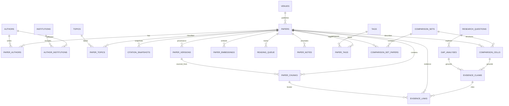

# Data Model and ERD

The schema is intentionally relational. JSONB is used only where the shape is provider-specific or genuinely extensible, such as source metadata payload fragments, saved-search filters, ingestion checkpoints, and canonical provenance summaries.

## Core ERD

`citations` is a directed edge table from `citing_paper_id` to either a local `cited_paper_id` or an external identifier when the cited work has not yet been materialized in the local corpus.

## Canonical paper identity constraints

The strongest scholarly identifiers are independently unique:

- `papers.doi`
- `papers.openalex_id`
- `papers.s2_id`
- `papers.arxiv_id`

The ingestion service normalizes identifier formats before lookup. It never silently resolves a collision where two existing rows own different strong identifiers. Title/year fallback matching is conservative and only used when no strong identifier exists.

## Relationship integrity

- `paper_authors`: unique paper/author pair; deleting a paper removes the join, deleting an author with referenced papers is restricted.
- `paper_topics`: unique paper/topic pair; topic deletion is restricted so historic classification is not silently lost.
- `paper_versions`: paper deletion is restricted because a version is a provenance record.
- `paper_chunks`: paper and source-version deletion are restricted because chunks can be evidence locators.
- `research_question_papers`: many-to-many question ↔ paper link; paper deletion is restricted.
- `research_question_saved_searches`: question ↔ saved-search link, cascading with either workspace object.
- `research_question_comparison_sets`: question ↔ comparison-set link, cascading with either workspace object.
- `research_question_notes`: private user-authored notes owned by a research question.
- `comparison_cells.origin`: constrained to `paper_evidence`, `system_inference`, or `user_note` so manual edits cannot be silently presented as extracted paper claims.
- `evidence_links`: linked papers/chunks are restricted from deletion while claims depend on them.
- `reading_queue`, `paper_notes`, and `paper_tags`: user workflow state cascades when its paper/tag is intentionally removed.

## Mutable scholarly state

Citation counts and OA status change over time. Current values live on the canonical paper for fast filtering, while `citation_snapshots` stores point-in-time values with `source` and `captured_at` so historical changes remain inspectable.

Retraction and correction flags are current canonical state. Source versions remain preserved so an update does not erase how the record looked at an earlier retrieval time.

## Provenance constraints

Every canonical paper has:

- `primary_source`
- `source_record_id`
- `retrieved_at`
- `license` when known
- a bounded canonical provenance summary

Each normalized provider record also creates a `paper_versions` row keyed by paper, provider, source record ID, and payload hash. Re-fetching an unchanged provider payload therefore does not create an unbounded duplicate version history.

## Evidence constraints

`evidence_claims.support_status` can be `supported`, `mixed`, `contradicted`, or `insufficient_evidence`. Application validation rejects a generated claim presented as supported/mixed/contradicted when it has no evidence links.

Evidence links record whether a paper/chunk `supports`, `contradicts`, or supplies `context`. A chunk link is optional because some comparisons can be grounded only to metadata/abstract level when lawful full text is unavailable; that limitation remains visible to the user.

## Search indexes

- GIN index on generated `papers.search_vector` for lexical title/abstract retrieval.
- HNSW cosine index on `paper_embeddings.embedding` for paper-level semantic retrieval.
- Partial HNSW cosine index on non-null `paper_chunks.embedding` for evidence-level retrieval.
- B-tree indexes on identifiers, year, venue, work type, OA status, topic joins, and relationship keys used by filters.

